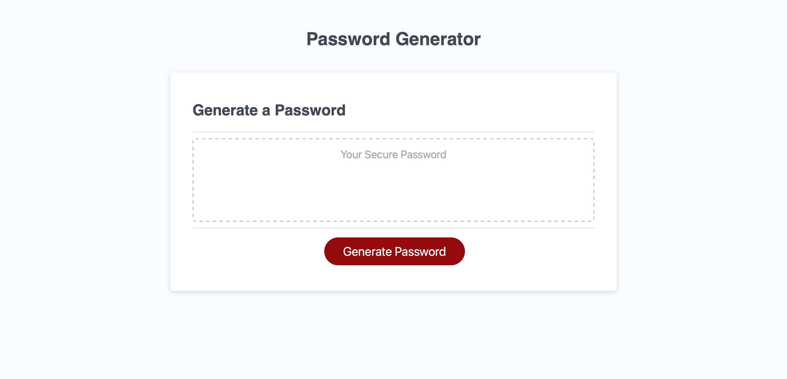

# My First Professional Portfolio
## UCLA Web Development Bootcamp Weekly Challenge Week 3.  JavaScript Password Generator

## Table of Contents

1. [Challenge Description](#challenge-description)

2. [Website Screen Shot](#website-screen-shot)

3. [Link to Live Deployment](#link-to-live-deployment)

4. [Link to Challenge Github Repository](#link-to-challenge-github-repository)

*  ## **Challenge Description**

Weekly Challenge Week 3.  JavaScript Password Generator.  Website to use password generator button to create a password.

*  ## **Website Screen Shot**

*  ## **Link to Live Deployment**
[Link to Live Deployment](https://github.com/Soft-Devel/password-generator "Password Generator Website Link")

* ## **Link to Challenge Github Repository**
[Link to Challenge Github Repository](https://soft-devel.github.io/password-generator/ "Password Generator Repository Link")